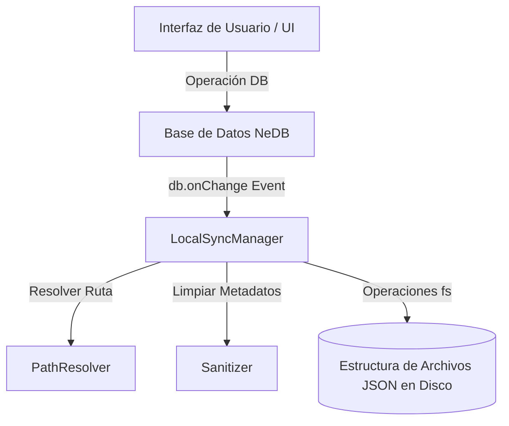

# Plan de Implementación: Sincronización Local Reactiva (Enfoque B)

Este documento detalla el plan y la arquitectura necesaria para implementar la sincronización local en tiempo real de los recursos de Insomnium (workspaces, peticiones, entornos y pruebas unitarias) hacia una estructura de directorios en disco en formato JSON.

---

## 1. Objetivo General
Hacer que Insomnium actúe como un motor "file-based" reactivo: cada cambio realizado en la UI (creación, edición o eliminación de llamadas, entornos o pruebas) debe reflejarse instantáneamente en una estructura jerárquica de archivos JSON en el disco local, facilitando el control de versiones con Git y la edición externa.

---

## 2. Arquitectura de Sincronización

La sincronización se basará en un flujo unidireccional reactivo (de la Base de Datos al Disco) con la posibilidad de configurarse como bidireccional en el futuro.



---

## 3. Componentes a Implementar

### A. Configuración del Destino (`packages/insomnia/src/models/settings.ts`)
1. **Nuevo Campo:** Añadir la propiedad `localSyncPath` (string) al modelo `Settings`.
2. **Interfaz de Usuario:** Agregar un selector de carpetas en la pestaña *General* de Configuración para que el usuario elija dónde sincronizar sus proyectos.

### B. Gestor de Sincronización (`packages/insomnia/src/sync/local-sync-manager.ts`)
Este módulo controlará el ciclo de vida de la sincronización:
1. **Inicialización:** Al iniciar la aplicación, si `localSyncPath` está configurada, realiza una exportación completa inicial para asegurar que el disco esté al día.
2. **Escucha Reactiva:** Se suscribe al hook global de la base de datos:
   ```typescript
   db.onChange(async (changes) => {
     if (!settings.localSyncPath) return;
     for (const [event, doc] of changes) {
       await handleDatabaseChange(event, doc);
     }
   });
   ```

### C. Resolutor de Rutas (`packages/insomnia/src/sync/path-resolver.ts`)
Responsable de traducir la relación jerárquica de la base de datos a rutas físicas válidas en el sistema de archivos:
1. **Cálculo de Ruta Jerárquica:**
   * Dado un documento, busca recursivamente sus ancestros (`db.withAncestors`).
   * Convierte los `RequestGroup` (carpetas) y el `Workspace` en directorios de la ruta.
2. **Sanitización de Nombres:**
   * Reemplaza caracteres no permitidos por los sistemas operativos (`/`, `\`, `?`, `*`, `:`, `|`, `<`, `>`, `"`) por guiones o caracteres seguros.
3. **Resolución de Colisiones:**
   * Si dos peticiones en la misma carpeta tienen el mismo nombre, se añade un sufijo diferenciador (ej. `nombre-peticion_req_123.json` o `nombre-peticion (1).json`).

### D. Limpiador de Datos / Sanitizer
Antes de escribir el JSON en el disco:
1. Utiliza `resetKeys(doc)` para limpiar claves de control volátiles.
2. Opcionalmente, remueve timestamps de base de datos como `modified` y `created` si se prefiere evitar "ruido" constante en los commits de Git (configurable).

---

## 4. Plan de Acción (Paso a Paso)

### Paso 1: Configuración del Entorno de Destino
* Modificar el modelo `Settings` para incluir `localSyncPath`.
* Modificar la UI de ajustes generales (`settings/general.tsx`) para permitir al usuario seleccionar una carpeta del disco mediante el diálogo nativo de Electron:
  ```typescript
  const { filePaths } = await window.dialog.showOpenDialog({ properties: ['openDirectory'] });
  ```

### Paso 2: Desarrollar el Resolutor de Rutas (`path-resolver.ts`)
* Crear funciones auxiliares para determinar el nombre de archivo y la ruta de destino exacta:
  * Para entornos: `[RutaWorkspace]/environments/[nombre-entorno].json`
  * Para peticiones: `[RutaWorkspace]/requests/[CarpetasAnidadas]/[nombre-peticion].json`
  * Para pruebas: `[RutaWorkspace]/tests/[nombre-suite]/[nombre-test].json`

### Paso 3: Implementar Manejadores de Mutaciones
En `LocalSyncManager`, procesar cada evento del `db.onChange`:
* **`insert` / `update`**:
  1. Calcular la ruta destino física mediante el resolutor de rutas.
  2. Asegurar que las carpetas intermedias existan (`fs.mkdirSync(dir, { recursive: true })`).
  3. Escribir el archivo serializado: `fs.writeFileSync(filePath, JSON.stringify(doc, null, 2))`.
* **`remove`**:
  1. Calcular la ruta física que correspondía al documento.
  2. Si es un archivo (petición/entorno/prueba), borrarlo: `fs.unlinkSync(filePath)`.
  3. Si es un contenedor (RequestGroup/Workspace/TestSuite), eliminar el directorio recursivamente si está vacío o si se confirma la purga: `fs.rmSync(dirPath, { recursive: true, force: true })`.

### Paso 4: Carga Inicial e Integración en el Ciclo de Vida
* Importar e inicializar `LocalSyncManager` dentro de `packages/insomnia/src/common/database.ts` en el método `init`.
* Implementar una rutina de exportación en lote en caso de activar la sincronización por primera vez en una carpeta existente.

---

## 5. Casos de Borde y Retos Técnicos

1. **Renombrado de Carpetas o Workspaces:**
   * Si el usuario renombra una carpeta en la UI, el resolutor de rutas cambiará la ruta de todos los hijos. 
   * *Solución:* El manejador de cambios debe detectar la modificación del nombre de un `RequestGroup` o `Workspace`, renombrar la carpeta física en disco (`fs.renameSync`) antes de actualizar los archivos internos, o limpiar y volver a exportar la rama afectada.
2. **Frecuencia de Escritura (Debouncing):**
   * Modificar continuamente el texto o los parámetros de una petición mientras se escribe genera ráfagas rápidas de eventos `update`.
   * *Solución:* Implementar un debouncing de escritura por archivo (ej. esperar 500ms de inactividad antes de guardar el JSON final en el disco) para evitar bloqueos del sistema de archivos e innecesario uso de disco.
3. **Control de Duplicados en Git:**
   * Dos usuarios en distintas ramas pueden modificar el mismo archivo JSON. Al estar formateado de manera consistente (`JSON.stringify(..., null, 2)` con orden de propiedades fijo), los conflictos de Git se resolverán con extrema facilidad en comparación con el archivo `.db` monolítico actual.
